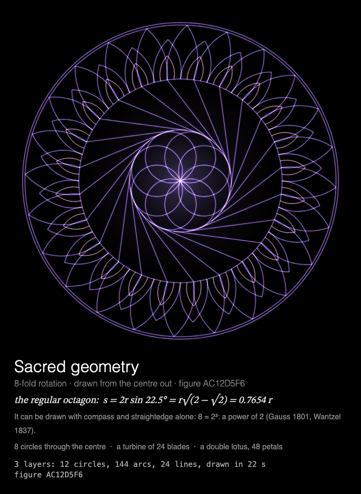

# MMM-SacredGeometry

A [MagicMirror²](https://magicmirror.builders/) module that draws a new sacred geometry figure each time it is shown, with compass and straightedge, from the centre out.



A figure no one has seen before, drawn from the centre out with compass and straightedge, every
symmetric copy at once: the Seed or Flower of Life, Metatron's Cube, stars within stars, a mystic
rose, a whirl, golden spirals or a lotus, ringed by star polygons, petals, beads, arcades or rings
after Whorld. Then it holds, finished. Underneath: the figure's symmetry, the side of its regular
polygon, whether that polygon can really be constructed, what the figure is made of, and its
number, which draws it again.

Built for a **Raspberry Pi 3 without GPU acceleration**: everything is drawn by the CPU, each
frame adds only what is new, the finished figure costs next to nothing to hold, and the
animation stops completely while the module is hidden (see [Performance](#performance)).

## Installation

```bash
cd ~/MagicMirror/modules
git clone https://github.com/charleswest775/MMM-SacredGeometry
```

No npm dependencies: nothing to install.

## Update

```bash
cd ~/MagicMirror/modules/MMM-SacredGeometry
git pull
```

## Configuration

```js
{
	module: "MMM-SacredGeometry",
	position: "middle_center",
	config: {
		cycleSeconds: 600,  // one figure per showing, a new one each time the module is shown
		sacredSeconds: 22,  // drawn in 22 s of a 30 s page, then held
		width: 700,
		height: 700,
		fps: 12
	}
},
```

| Option | Default | Description |
|---|---|---|
| `sacredSeconds` | `22` | Seconds to draw a figure; then it holds |
| `sacredSeed` | none | Draw this figure every time, by the number shown under it, e.g. `"3A7F21C0"` |
| `sacredFolds` | `[]` | Symmetries to choose from, e.g. `[6, 12]`. Empty = all: 3, 4, 5, 6, 7, 8, 9, 10, 12, 16, 18, 20, 24 |
| `sacredPalettes` | `[]` | Colours to choose from, e.g. `["gold", "sapphire"]`. Empty = all: `gold`, `sapphire`, `rose`, `jade`, `amethyst`, `silver`, `spectrum`, `fire`, `aurora` |
| `cycleSeconds` | `600` | A new figure this often while shown; there is always a new one each time the module is shown again |
| `width`, `height` | `700` | Canvas size in pixels |
| `fps` | `12` | Frame-rate cap; lower = less CPU |
| `showMath` | `true` | The caption under the canvas: title, the polygon's side, constructibility, layers and the figure's number |
| `turns` | `null` | `{ of: n, at: k }`: show only on every nth showing, from showing k (counting from 0), so modules sharing a page can take turns (see [Taking turns](#taking-turns)) |
| `statsPanel` | `false` | A line under the caption showing what the mirror spends: fps, CPU of Electron and the compositor, a bar per core, temperature. Sampled by the module's `node_helper` from `/proc`, only while the module is shown |
| `debugStats` | `false` | Show achieved fps and per-frame timings in the corner of the screen |

## Taking turns

Every page added to a rotation makes it longer. Modules can share a page instead and take turns:
with `turns: { of: n, at: k }`, modules on the same [MMM-pages](https://github.com/edward-shen/MMM-pages)
page each show on their own one in n showings. A module whose turn it isn't takes no room on the
page and costs nothing until the page comes round again.

Three kinds of figure that draw themselves and hold, one per showing:

```js
{
	module: "MMM-SacredGeometry",
	classes: "page-figures",
	position: "middle_center",
	config: { turns: { of: 3, at: 0 } }
},
{
	module: "MMM-Tilings",
	classes: "page-figures",
	position: "middle_center",
	config: { turns: { of: 3, at: 1 } }
},
{
	module: "MMM-PlanetsDance",
	classes: "page-figures",
	position: "middle_center",
	config: { turns: { of: 3, at: 2 } }
},
{
	module: "MMM-pages",
	config: { modules: [["page-home"], ["page-figures"]], rotationTime: 30000 }
},
```

Without `turns` the module works just as well on a page of its own, or in a normal region with
no MMM-pages at all: then it draws a new figure every `cycleSeconds`.

## How the figures are made

Each showing makes a new figure from a random 32-bit seed, and draws it the way it would be
drawn by hand: from the centre out, the compass first, then the straightedge. Every symmetric
copy is drawn at once by a pen of its own, so the figure is symmetric at every moment. In
mirror-symmetric figures each element is drawn symmetrically too: a circle by two pens setting
off in opposite directions from its point nearest the centre, a line from its middle out to
both ends; so circles through the centre bloom out of it. A third of the figures turn instead:
whirls, pinwheels, leaning petals, and pens that all go round the same way. Lines are added
with `lighter` compositing, so where they cross they brighten, as light does, around a soft glow
at the centre.

A figure is a core, one to three bands and a rim:

- **cores**: the Seed of Life (six circles through the centre, each centred on the first, so the
  compass never changes) or up to 30 circles through the centre; the Flower of Life (circles on
  a triangular lattice, cut off at the boundary: 19 whole circles and the arcs completing the
  petals); Metatron's Cube (the Fruit of Life's 13 circles and the 78 lines between their
  centres); stars within stars (each star's crossing sides are the next one's points: each
  pentagram is 1/φ² the last); a whirl of pursuit polygons, each with its corners a little way
  along the last one's sides, so every corner runs in on a logarithmic spiral; a times table,
  point j of N joined to point (n + 1)·j, whose lines' envelope is an epicycloid with n cusps
  (with one, the cardioid), or to (1 − n)·j, a hypocycloid; a mystic rose, every chord of its
  points; spirals crossing like a sunflower's seeds, golden ones growing by φ each quarter turn;
  a lotus.
- **bands**, each on the circle the last ended on: star polygons {k/q} whose sides touch that
  circle (so their points are at r / cos(πq/k)); lotus petals; beads touching the circle and
  each other; an arcade of arches; rings after [Whorld](https://victimofleisure.github.io/Whorld/),
  each a star with its corners pulled in or out by a factor swinging on a sine as Whorld's
  oscillators do, twisted further the farther out it is; logarithmic spirals; rays; rosettes,
  small Seeds of Life repeating the figure in miniature, as
  [OmniGeometry](https://www.omnigeometry.com/sacred-geometry-software/) draws a shape at the
  points of itself.

The symmetry is one of 3, 4, 5, 6, 7, 8, 9, 10, 12, 16, 18, 20 or 24, and the caption gives the
side of its regular polygon and whether it could really be drawn with compass and straightedge
alone: by the Gauss–Wantzel theorem only when n is a power of 2 times distinct Fermat primes
(3, 5, 17, 257, 65537), so the 7-, 9- and 18-gons' corners are computed, not constructed.
Spirals and Whorld's Bézier curves can't be drawn with compass and straightedge either: the
readout says "by hand" while they're drawn. No two figures in a row share their core, palette
or symmetry. The number under a finished figure draws it again (`sacredSeed`), and
`dev/sacred-gallery.html` shows a wall of them to choose from.

Inspired by Quentin Carpenter's
[108 Sacred Geometry Animations](https://www.youtube.com/watch?v=_--7KU0oZOc) (light lines on
black around a glowing centre), [evoluteur/sacred-geometry](https://github.com/evoluteur/sacred-geometry)
(figures that draw themselves stroke by stroke, from circles and lines only), Whorld and
OmniGeometry.

## Performance

Measured on a Raspberry Pi 3 B+ (Electron 42, software rendering, no GPU), as CPU of the
Electron processes plus the `cage` compositor, in % of one core (the Pi has four), 700×700 at
12 fps, over six showings with the stats panel on:

| | % of one core | achieved fps |
|---|---|---|
| module hidden (e.g. another MMM-pages page); baseline mirror without it 0.2 | 0.3 | 0 |
| while a figure is drawn (27–63 in 3-s windows) | 42 | 12 |
| the first 3 s, as the page fades in and the glow with it | ~117 | |
| the finished figure held (most of it the stats panel) | 3 | 0 |
| over a 30 s showing, page change included | 41 | |

It holds 12 fps throughout, so the figure is finished on time, ~24 s after the page appears.

Why it costs what it does:

- Everything is drawn by the CPU: the Pi 3's GPU can't run Chromium's accelerated canvas. Any
  frame that changes the canvas costs ~2% of a core per fps before drawing anything; on top of
  that, cost grows with the area that changes, since Chromium redraws the bounding box of
  everything touched in a frame. So each frame adds only what the pens drew since the last one.
  The pens are spread round the figure, so a frame's changes still span much of it.
- The frame rate is capped (`fps`): the loop sleeps with `setTimeout` until a frame is due, and
  only then asks for an animation frame. JavaScript is not the bottleneck (a few ms per frame).
- Once the figure is finished the module rests, polled only twice a second.
- While MagicMirror fades the module out nothing new is drawn, and once it is hidden the loop
  stops entirely.

## Development

```bash
node --test                  # geometry checks, no dependencies
python3 -m http.server       # in the module folder; then open http://localhost:8000/dev/preview.html
```

`dev/preview.html` runs the module outside MagicMirror², in a portrait 1200×1920 frame, with
hide/show buttons that follow MagicMirror's suspend/resume order. Query options override the
config, e.g. `?sacredSeed=3A7F21C0`, `?sacredFolds=6,12&sacredPalettes=gold,sapphire`,
`?sacredSeconds=10&statsPanel=true`. `dev/sacred-gallery.html` shows a wall of finished figures
(`?count=12&size=300`, `?seeds=3A7F21C0,1B2C3D4E`, `?sacredFolds=6,12`, `?sacredPalettes=gold`);
click one to watch it being drawn in the preview.

The tests check the geometry rather than looks: that the Flower of Life has its 19 circles and
Metatron's Cube its 13 circles and 78 lines, that star polygons' sides touch the circle they
should and nested pentagrams shrink by 1/φ², that pursuit polygons' corners lie on the last
one's sides, that a golden spiral grows by φ a quarter turn, which polygons are constructible
(checked against OEIS A003401), and, for many random figures, that each fills the unit circle
and has the n-fold (and mirror) symmetry it claims, and that every stroke is drawn exactly once.

## License

MIT. The figures are the module's own; the ideas are credited under
[How the figures are made](#how-the-figures-are-made).

Part of a family of modules for the same mirror:
[MMM-ChaosTheory](https://github.com/charleswest775/MMM-ChaosTheory),
[MMM-Atom](https://github.com/charleswest775/MMM-Atom),
[MMM-FractalZoom](https://github.com/charleswest775/MMM-FractalZoom),
[MMM-Chladni](https://github.com/charleswest775/MMM-Chladni),
[MMM-Tilings](https://github.com/charleswest775/MMM-Tilings),
[MMM-PlanetsDance](https://github.com/charleswest775/MMM-PlanetsDance),
[MMM-SnowCrystal](https://github.com/charleswest775/MMM-SnowCrystal),
[MMM-NightSky](https://github.com/charleswest775/MMM-NightSky),
[MMM-PhotoDeck](https://github.com/charleswest775/MMM-PhotoDeck).
